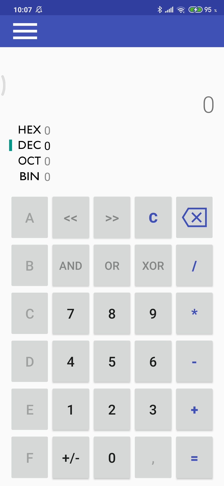

# МегаКалькулятор
## Создатели
Сироткин Семен
Зубарев Филипп
## Актуальность
Точность вычислений всегда была важна, потому и были созданы калькуляторы,
однако их удобство во все времена их существования оставляло желаить лучшего.
Именно поэтому мы создали калькуляторЮ который будет удобен и полезен всем, из-за разделения на режимы,
которые можно использовать  не только по отдельности, но и комбинировать работу с ними для получения
лучшего результата.
## Создание
Калькулятор для телефона создавался на android studio с использованием языка программирования java и
языка разметки xml. Приложение поделено на несколько экранов, каждый из которых предназначен для каждого
режима работы калькулятора.
## Скриншоты приложения

